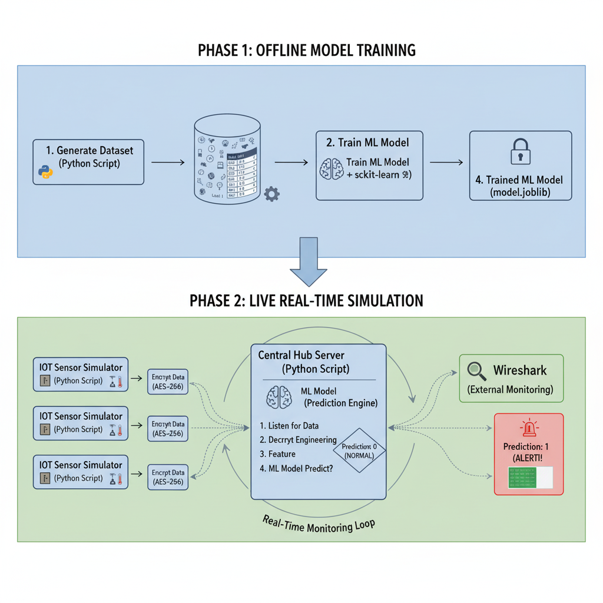

# 🛡️ IoT Watchdog: A Simulated ML-Based Intrusion Detection System

A **Python-based simulation** of a **Machine Learning Intrusion Detection System (IDS)** for a secure, encrypted **smart building IoT network**.

This project demonstrates how **AI and encryption** can work together to secure IoT ecosystems. It simulates multiple IoT sensors communicating with a central hub, where all sensor data is **AES-256 encrypted** and analyzed in real-time by a **Random Forest ML model** for anomaly detection.

---

## 🏗️ Project Architecture

The project operates in **two main phases** — *Offline Training* and *Online Simulation*.




### **Phase 1: Offline Model Training**
- A labeled dataset (`data.csv`) is used to train a Random Forest classifier to distinguish between **Normal** and **Anomalous** activity.
- The training script (`train_model.py`) outputs:
  - `model_pipeline.joblib` — Trained model pipeline  
  - `label_encoder.joblib` — Encoded label mappings

### **Phase 2: Online Simulation**
- Multiple sensor scripts send **encrypted** data to a central **hub server**.
- The hub:
  - Decrypts incoming packets (AES-256 CBC mode)
  - Extracts features and predicts anomalies in real-time
  - Displays live logs and alerts for suspicious activities

---

## ⚙️ Key Features

| Feature | Description |
|----------|--------------|
| **Real-Time Monitoring** | The central hub listens for and processes data from multiple sensors concurrently using Python's threading. |
| **End-to-End Encryption** | All communication between sensors and hub is secured using AES-256 (CBC mode) with a shared 32-byte key. |
| **ML-Based Detection** | A scikit-learn Random Forest pipeline identifies anomalies beyond simple threshold-based rules. |
| **Modular Design** | Easily add more simulated sensors (e.g., `sensor_window.py`) to scale the building network. |

---

## 🔐 Security Attributes

| Attribute | Description |
|------------|--------------|
| **Authentication** | Only sensors with the correct AES key can successfully send data. The hub implicitly authenticates sensors since unauthorized data fails to decrypt. |
| **Confidentiality** | Data packets are fully encrypted — network sniffers (like Wireshark) will only capture random bytes, not readable JSON. |
| **Integrity** | CBC mode and padding validation ensure tampered packets fail decryption and are automatically discarded. |

---

## 📂 Project Structure
```
smart_building_security/
├── phase_1_model_training/
│   ├── data.csv                # Dataset used for training
│   └── train_model.py          # One-time training script
├── phase_2_simulation/
│   ├── hub_server.py           # Central hub / IDS brain
│   ├── sensor_door.py          # Simulates a door sensor
│   ├── sensor_motion.py        # Simulates a motion sensor
│   └── sensor_temp.py          # Simulates a temperature sensor
├── model_pipeline.joblib       # Trained model (created after training)
├── label_encoder.joblib        # Label encoder file
├── requirements.txt            # Dependencies list
└── README.md                   # This documentation
```

---

## 🚀 How to Run the Simulation

Follow these steps **exactly** to experience the full end-to-end simulation.

### **1. Prerequisites**

1. Clone this repository:
```bash
   git clone https://github.com/yourusername/smart_building_security.git
   cd smart_building_security
```

2. (Recommended) Create and activate a virtual environment:
```bash
   python -m venv .venv
   source .venv/bin/activate        # On Windows: .venv\Scripts\activate
```

3. Install dependencies:
```bash
   pip install -r requirements.txt
```

### **2. Step 1: Train the Model (Run Once)**

Navigate to the training directory and run the script:
```bash
cd phase_1_model_training
python train_model.py
```

✅ You should see messages like:
```bash
Model training complete.
Model pipeline saved to ../model_pipeline.joblib
```

This step generates the model files required for the live simulation.

### **3. Step 2: Run the Live Simulation**

You'll need four terminals open for this step.

#### Terminal 1: Start the Hub Server
```bash
cd phase_2_simulation
python hub_server.py
```

It will display:
```csharp
[Hub] Listening for connections on 127.0.0.1:9999...
```

#### Terminals 2–4: Start the Sensors
Each sensor runs in its own terminal:

**Terminal 2:**
```bash
cd phase_2_simulation
python sensor_door.py
```

**Terminal 3:**
```bash
cd phase_2_simulation
python sensor_motion.py
```

**Terminal 4:**
```bash
cd phase_2_simulation
python sensor_temp.py
```

### **4. Step 3: Observe Real-Time Results**

On the hub terminal, you'll see live logs similar to:
```csharp
[New Connection] Accepted from 127.0.0.1:51234
[Data Received] from Door-001: Door=1.0
[Status] System Normal. Prediction: Normal

[New Connection] Accepted from 127.0.0.1:51235
[Data Received] from Motion-001: Motion=1.0
[Status] System Normal. Prediction: Normal
```

#### ⚠️ Testing Anomalies

To simulate an alert condition, modify the time logic to "force" a Night scenario.

1. Stop the hub (Ctrl + C).

2. Open `phase_2_simulation/hub_server.py`.

3. Locate the function `get_time_features()` and temporarily change it:
```python
   def get_time_features(timestamp):
       # --- TEMPORARY TEST ---
       time_of_day = 'Night'  # Force the time to be "Night"
       # ----------------------
       return time_of_day, day_of_week
```

4. Save and rerun the hub:
```bash
   python hub_server.py
```

Now, when sensors send data, the ML model should raise an alert:
```diff
!!! ALERT !!! Anomaly detected in Door-001
```

---

## 🧠 Technologies Used

- Python 3.10+
- Scikit-learn (Random Forest)
- Cryptography (AES-256 CBC)
- Socket Programming
- Threading
- Joblib

---

## 📘 Future Enhancements

- Integrate a web dashboard for visualization (Flask + WebSocket).
- Add role-based authentication for sensors.
- Support real IoT hardware (e.g., Raspberry Pi or ESP32).

---

## 🧩 Author

**IoT Watchdog Project**  
Developed for demonstrating secure, ML-driven IoT intrusion detection principles.
